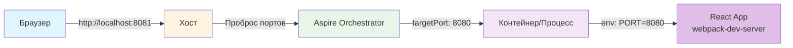

# Настройка HTTP эндпоинтов в .NET Aspire

## Введение

Метод `WithHttpEndpoint` в .NET Aspire используется для настройки HTTP эндпоинтов для приложений, особенно для JavaScript приложений (React, Vue, Angular). Этот метод позволяет управлять портами, переменными окружения и пробросом портов между хостом и контейнерами.

## Базовое использование

Простейший пример использования метода `WithHttpEndpoint`:

```csharp
builder.AddJavaScriptApp("react", "../PasswordManager-Client", runScriptName: "start")
    .WithHttpEndpoint(env: "PORT", port: 8080)
    .WithExternalHttpEndpoints();
```

В этом случае:
- Переменная окружения `PORT` будет установлена в значение `8080`
- Приложение будет доступно на порту 8080
- Порт будет проброшен на хост через `.WithExternalHttpEndpoints()`

## Параметры метода

Метод `WithHttpEndpoint` принимает следующие параметры:

### `env: string`
Имя переменной окружения, в которую Aspire подставит значение порта.

**Пример:**
```csharp
.WithHttpEndpoint(env: "PORT")
```

При запуске приложения Aspire установит переменную окружения `PORT` со значением порта, который можно использовать в приложении (например, `process.env.PORT` в Node.js).

### `targetPort: int`
Внутренний порт - это порт, на котором приложение слушает **внутри контейнера или процесса**.

**Важно:** Это порт, который видит само приложение. Это не порт на хосте.

**Пример:**
```csharp
.WithHttpEndpoint(env: "PORT", targetPort: 8080)
```

В этом случае приложение будет слушать на порту 8080 внутри контейнера.

### `port: int`
Внешний порт - это порт на **хосте** (вашем компьютере), через который можно получить доступ к приложению извне.

**Пример:**
```csharp
.WithHttpEndpoint(env: "PORT", targetPort: 8080, port: 8081)
```

В этом случае:
- Приложение слушает на порту 8080 внутри контейнера
- С хоста приложение доступно по `http://localhost:8081`
- Aspire автоматически пробрасывает трафик с порта 8081 на порт 8080

### `name: string`
Имя эндпоинта для идентификации в Aspire. Используется для ссылок на этот эндпоинт в других ресурсах.

**Пример:**
```csharp
.WithHttpEndpoint(env: "PORT", targetPort: 8080, port: 8081, name: "reactEndpointName")
```

Это имя позволяет обращаться к эндпоинту по имени, например: `{reactEndpointName.bindings.http.url}` в других ресурсах.

## Расширенный пример

Полный пример из проекта:

```22:22:AspireJavaScript.AppHost/AppHost.cs
        .WithHttpEndpoint(env: "PORT", targetPort: 8080, port: 8081, name: "reactEnoiuntName")
```

**Разбор параметров:**

1. **`env: "PORT"`** - Переменная окружения `PORT` будет установлена в значение `8080` (из `targetPort`)
2. **`targetPort: 8080`** - React приложение будет слушать на порту 8080 внутри контейнера
3. **`port: 8081`** - С хоста приложение доступно по `http://localhost:8081`
4. **`name: "reactEnoiuntName"`** - Имя эндпоинта для идентификации (примечание: в имени есть опечатка, вероятно имелось в виду `"reactEndpointName"`)

## Использование в React приложении

### Webpack конфигурация

В файле `PasswordManager-Client/webpack.config.js` переменная `PORT` используется следующим образом:

```9:9:PasswordManager-Client/webpack.config.js
      port: env.PORT || 8080,
```

Webpack-dev-server получает порт через параметр `env.PORT`, который передается из переменной окружения.

### Package.json скрипты

В файле `PasswordManager-Client/package.json` переменная `PORT` передается в webpack:

```53:54:PasswordManager-Client/package.json
    "start:win32": "webpack-dev-server --mode development --hot --env PORT=%PORT%",
    "start:default": "webpack-dev-server --mode development --hot --env PORT=$PORT",
```

- Для Windows используется синтаксис `%PORT%`
- Для Unix-систем используется синтаксис `$PORT`

Webpack-cli автоматически передает переменные окружения в параметр `env`, который доступен в `webpack.config.js`.

## Концепция внутреннего и внешнего портов

### Внутренний порт (targetPort)

**Внутренний порт** - это порт, на котором приложение слушает **внутри контейнера или процесса**. Это порт, который видит само приложение.

**Аналогия:** Номер комнаты внутри отеля - знает только приложение.

### Внешний порт (port)

**Внешний порт** - это порт на **хосте** (вашем компьютере), через который можно получить доступ к приложению извне.

**Аналогия:** Номер на входной двери отеля - виден снаружи.

### Визуализация потока запросов

```
┌─────────────────────────────────────────────────┐
│  ХОСТ (ваш компьютер)                           │
│                                                 │
│  Браузер обращается к:                          │
│  http://localhost:8081  ◄─── ВНЕШНИЙ порт      │
│         │                                        │
│         │ (проброс портов через Aspire)         │
│         ▼                                        │
│  ┌──────────────────────┐                       │
│  │  КОНТЕЙНЕР/ПРОЦЕСС   │                       │
│  │                      │                       │
│  │  React app слушает:  │                       │
│  │  http://0.0.0.0:8080 │ ◄─── ВНУТРЕННИЙ порт │
│  │                      │                       │
│  └──────────────────────┘                       │
└─────────────────────────────────────────────────┘
```

### Как это работает

1. React приложение запускается и слушает на порту 8080 (внутри контейнера) - это `targetPort`
2. Aspire пробрасывает трафик: внешний порт 8081 → внутренний порт 8080
3. С браузера вы обращаетесь к `http://localhost:8081` (внешний порт)
4. Aspire автоматически перенаправляет запрос на внутренний порт 8080, где слушает React приложение

### Зачем это нужно?

- **Изоляция:** Приложение работает в своем изолированном пространстве
- **Гибкость:** Можно менять внешний порт без изменения приложения
- **Управление:** Aspire контролирует проброс портов и маршрутизацию
- **Сервисное обнаружение:** Другие сервисы могут обращаться к приложению через Aspire

## Диаграмма архитектуры



## Связанные файлы

- [AspireJavaScript.AppHost/AppHost.cs](../../../AspireJavaScript.AppHost/AppHost.cs) - конфигурация AppHost
- [PasswordManager-Client/webpack.config.js](../../../PasswordManager-Client/webpack.config.js) - конфигурация webpack
- [PasswordManager-Client/package.json](../../../PasswordManager-Client/package.json) - скрипты запуска

## Дополнительные ресурсы

- [.NET Aspire Documentation](https://learn.microsoft.com/en-us/dotnet/aspire/)
- [Service Discovery in Aspire](https://learn.microsoft.com/en-us/dotnet/aspire/fundamentals/service-discovery)

