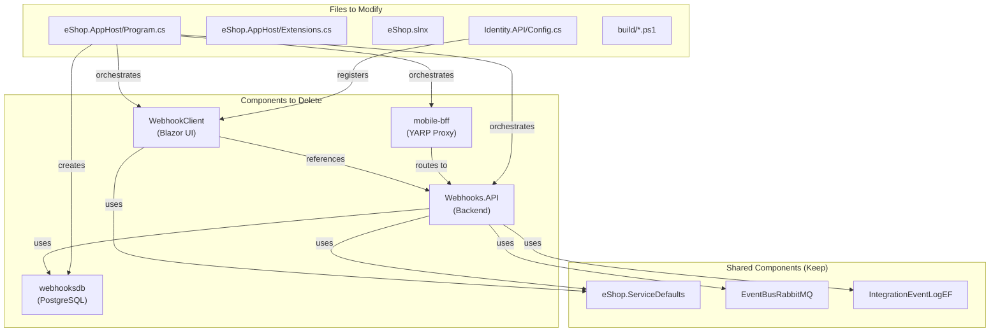

# Plan: Delete Mobile App (WebhookClient) and All Related Components

This plan removes the mobile client (`WebhookClient`) and all associated infrastructure from the eShop monorepo. The mobile app is already deprecated (no live users), so we can safely perform a full cleanup.

## Dependency Diagram



## Phase 1: Remove Projects from Solution

1. **Edit [`eShop.slnx`](eShop.slnx)** - Remove project references:

   - Delete line: `<Project Path="src/WebhookClient/WebhookClient.csproj" />`
   - Delete line: `<Project Path="src/Webhooks.API/Webhooks.API.csproj" />`

## Phase 2: Update AppHost Orchestration

2. **Edit [`src/eShop.AppHost/Program.cs`](src/eShop.AppHost/Program.cs)** - Remove all webhook/mobile references:

   - Delete: `var webhooksDb = postgres.AddDatabase("webhooksdb");` (line 18)
   - Delete: `webHooksApi` project definition (lines 53-56)
   - Delete: `mobile-bff` YARP proxy (lines 59-61)
   - Delete: `webhooksClient` project definition (lines 64-66)
   - Delete: `webhooksClient` callback URL (line 92)
   - Delete: Identity API webhook environment variables (lines 97-98)

3. **Edit [`src/eShop.AppHost/Extensions.cs`](src/eShop.AppHost/Extensions.cs)** - Remove mobile BFF routing:

   - Delete entire `ConfigureMobileBffRoutes` method (lines 185-250)
   - Remove related YARP using statements if no longer needed

## Phase 3: Update Identity Configuration

4. **Edit [`src/Identity.API/Configuration/Config.cs`](src/Identity.API/Configuration/Config.cs)** - Remove webhook-related auth configuration:

   - Delete `"webhooks"` API resource (line 12)
   - Delete `"webhooks"` API scope (line 24)
   - Delete `"maui"` client definition (lines 44-75) - mobile app client
   - Delete `"webhooks"` from `"webapp"` client scopes (line 107)
   - Delete `"webhooksclient"` client definition (lines 112-143)
   - Delete `"webhooksswaggerui"` client definition (lines 174-188)

## Phase 4: Update Build Scripts

5. **Edit [`build/multiarch-manifests/create-manifests.ps1`](build/multiarch-manifests/create-manifests.ps1)** - Remove mobile images:

   - Delete `"webhooks.api"` from `$services` array
   - Delete `"webhooks.client"` from `$services` array
   - Delete `"mobileshoppingagg"` from `$services` array (if applicable)

## Phase 5: Delete Project Directories

6. **Delete source directories:**

   - Delete folder: `src/WebhookClient/` (33 files)
   - Delete folder: `src/Webhooks.API/` (31 files)

7. **Delete build artifacts (optional cleanup):**

   - Delete folder: `artifacts/bin/WebhookClient/`
   - Delete folder: `artifacts/bin/Webhooks.API/`
   - Delete folder: `artifacts/obj/WebhookClient/`
   - Delete folder: `artifacts/obj/Webhooks.API/`

## Phase 6: Verification

8. **Build and verify:**

   - Run `dotnet build eShop.slnx` to ensure no broken references
   - Run `dotnet run --project src/eShop.AppHost` to verify orchestration works
   - Check that remaining services (WebApp, Catalog, Basket, Ordering, Identity) still function

## Summary of Changes

| Component | Action | Files/Lines |

|-----------|--------|-------------|

| WebhookClient | DELETE | 33 files |

| Webhooks.API | DELETE | 31 files |

| eShop.slnx | MODIFY | -2 lines |

| AppHost/Program.cs | MODIFY | -12 lines |

| AppHost/Extensions.cs | MODIFY | -65 lines |

| Identity.API/Config.cs | MODIFY | -60 lines |

| build scripts | MODIFY | -3 services |

## Risks and Mitigations

- **Shared libraries**: `EventBusRabbitMQ`, `IntegrationEventLogEF`, `eShop.ServiceDefaults` are used by other services, so they will NOT be deleted
- **Database**: `webhooksdb` is only used by Webhooks.API; removing it from AppHost is sufficient (no data migration needed since app is dead)
- **Build failure**: If any file references webhooks, the build will fail immediately, making issues easy to catch

---

## Additional Cleanup (2026-01-21)

После основного удаления была выполнена дополнительная очистка упоминаний:

### Build Scripts Cleanup

**Файл: `build/acr-build/queue-all.ps1`**

- ✅ Удалено: `mobileshoppingagg` (Mobile BFF)
- ✅ Обновлены пути к Dockerfile'ам под текущую структуру проекта
- ✅ Удалены устаревшие компоненты (WebSPA, WebMVC, WebStatus, OcelotApiGw, SignalrHub)

**Файл: `build/multiarch-manifests/create-manifests.ps1`**

- ✅ Удалены все устаревшие сервисы из списка
- ✅ Оставлены только актуальные компоненты текущей Aspire архитектуры

### Identity Configuration Cleanup

**Файл: `src/Identity.API/Configuration/Config.cs`**

- ✅ Удалён scope `"webshoppingagg"` из `AllowedScopes` клиента "webapp"

### Verification

Выполнена проверка на отсутствие упоминаний:

```bash
grep -r "WebSPA|WebMVC|WebStatus|OcelotApiGw|SignalrHub|webshoppingagg|mobileshoppingagg|webhook|WebhookClient|Webhooks\.API|mobile-bff" -i
# Результат: No matches found ✅
```

### Документация

Создан файл: `.cursor/docs/cleanup/removed-legacy-components.md`

- Детальное описание всех удалённых компонентов
- Текущая архитектура проекта
- Список изменённых файлов