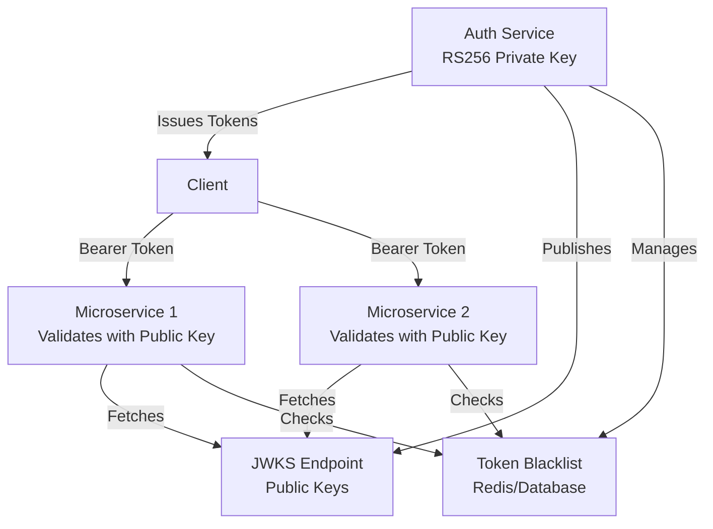

# План улучшения JWT для микросервисов

## Текущее состояние

Анализ текущей реализации показал следующие проблемы:

- Используется **HS256** (симметричное шифрование) вместо **RS256** (асимметричное)
- Время жизни access token слишком большое (15000 минут ≈ 10 дней)
- Нет разделения времени жизни для access и refresh токенов
- Отсутствуют стандартные JWT claims (sub, iat, exp, iss, aud)
- Нет JWKS endpoint для распространения публичных ключей
- Нет blacklist для отозванных токенов
- Используется `DateTime.Now` вместо `DateTime.UtcNow` в некоторых местах
- Нет логирования попыток использования невалидных токенов
- Нет кэширования публичных ключей

## Архитектура решения

## Задачи реализации

### 1. Переход на RS256 (асимметричное шифрование)

**Файлы для изменения:**

- [`PasswordManager/Services/AuthenticationService.cs`](PasswordManager/Services/AuthenticationService.cs) - метод `GetSigningCredentials()`
- [`PasswordManager/PasswordManager.Startup/Configuration/JwtBearerOptionsSetup.cs`](PasswordManager/PasswordManager.Startup/Configuration/JwtBearerOptionsSetup.cs) - валидация токенов
- [`PasswordManager/PasswordManager.Startup.Api/Config/JwtConfiguration.cs`](PasswordManager/PasswordManager.Startup.Api/Config/JwtConfiguration.cs) - добавить настройки для RSA ключей

**Изменения:**

- Генерация RSA ключевой пары (при первом запуске или через конфигурацию)
- Хранение приватного ключа в безопасном хранилище
- Использование `RsaSecurityKey` вместо `SymmetricSecurityKey`
- Изменение алгоритма на `SecurityAlgorithms.RsaSha256`

### 2. Добавление JWKS Endpoint

**Новые файлы:**

- `PasswordManager/UserPasswords.Presentation/Controllers/JwksController.cs` - контроллер для JWKS endpoint
- `PasswordManager/Services/IJwksService.cs` - интерфейс сервиса JWKS
- `PasswordManager/Services/JwksService.cs` - реализация сервиса JWKS

**Функциональность:**

- Endpoint `/api/.well-known/jwks.json` для получения публичных ключей
- Формат JWKS (JSON Web Key Set) согласно RFC 7517
- Кэширование ключей с TTL 1-24 часа

### 3. Улучшение структуры JWT Claims

**Файлы для изменения:**

- [`PasswordManager/Services/AuthenticationService.cs`](PasswordManager/Services/AuthenticationService.cs) - метод `GetClaims()`

**Добавить стандартные claims:**

- `sub` (subject) - user ID
- `iat` (issued at) - время выдачи
- `exp` (expiration) - время истечения
- `iss` (issuer) - издатель токена
- `aud` (audience) - получатель токена
- `email` - email пользователя
- `jti` (JWT ID) - уникальный идентификатор токена

### 4. Оптимизация времени жизни токенов

**Файлы для изменения:**

- [`PasswordManager/PasswordManager.Startup.Api/Config/JwtConfiguration.cs`](PasswordManager/PasswordManager.Startup.Api/Config/JwtConfiguration.cs) - добавить `AccessTokenExpires` и `RefreshTokenExpires`
- [`PasswordManager/Services/AuthenticationService.cs`](PasswordManager/Services/AuthenticationService.cs) - метод `GenerateTokenOptions()` и `CreateToken()`
- [`PasswordManager/PasswordManager.Startup/appsettings.json`](PasswordManager/PasswordManager.Startup/appsettings.json) - обновить конфигурацию

**Рекомендуемые значения:**

- Access Token: 15-30 минут
- Refresh Token: 7-30 дней

### 5. Исправление использования UTC времени

**Файлы для изменения:**

- [`PasswordManager/Services/AuthenticationService.cs`](PasswordManager/Services/AuthenticationService.cs) - метод `GenerateTokenOptions()` - заменить `DateTime.Now` на `DateTime.UtcNow`

### 6. Добавление Token Blacklist

**Новые файлы:**

- `PasswordManager/Services.Contracts/ITokenBlacklistService.cs` - интерфейс сервиса blacklist
- `PasswordManager/Services/TokenBlacklistService.cs` - реализация (Redis или Database)
- `PasswordManager/PasswordManager.Startup/Extensions/TokenBlacklistExtensions.cs` - регистрация сервиса

**Функциональность:**

- Хранение отозванных токенов до истечения их срока действия
- Проверка blacklist при валидации токена
- Методы для отзыва токенов (logout, смена пароля)

### 7. Улучшение логирования и мониторинга

**Файлы для изменения:**

- [`PasswordManager/PasswordManager.Startup/Configuration/JwtBearerOptionsSetup.cs`](PasswordManager/PasswordManager.Startup/Configuration/JwtBearerOptionsSetup.cs) - добавить обработчики событий JWT

**Добавить логирование:**

- Попытки использования невалидных токенов
- Попытки использования отозванных токенов
- Частота обновления токенов
- Ошибки валидации токенов

### 8. Кэширование публичных ключей в микросервисах

**Новые файлы:**

- `PasswordManager/Services/IJwksCacheService.cs` - интерфейс кэша
- `PasswordManager/Services/JwksCacheService.cs` - реализация кэша с TTL

**Функциональность:**

- Кэширование публичных ключей из JWKS endpoint
- Автоматическое обновление при истечении TTL
- Fallback на прямой запрос при ошибках кэша

### 9. Обновление конфигурации

**Файлы для изменения:**

- [`PasswordManager/PasswordManager.Startup/appsettings.json`](PasswordManager/PasswordManager.Startup/appsettings.json)
- [`PasswordManager/PasswordManager.Startup/appsettings.Development.json`](PasswordManager/PasswordManager.Startup/appsettings.Development.json)

**Добавить настройки:**

- `AccessTokenExpires` (минуты)
- `RefreshTokenExpires` (дни)
- `RsaPrivateKeyPath` или `RsaPrivateKey` (опционально, для production)
- `JwksCacheExpirationMinutes`
- `TokenBlacklistProvider` (Redis/Database)

### 10. Обновление Refresh Token логики

**Файлы для изменения:**

- [`PasswordManager/Services/AuthenticationService.cs`](PasswordManager/Services/AuthenticationService.cs) - метод `RefreshToken()`

**Улучшения:**

- Проверка blacklist для refresh token
- Ротация refresh token (выдача нового при обновлении)
- Логирование подозрительной активности

## Порядок реализации

1. **Фаза 1: Базовая инфраструктура**

   - Переход на RS256
   - Добавление стандартных claims
   - Исправление UTC времени
   - Оптимизация времени жизни токенов

2. **Фаза 2: Микросервисная поддержка**

   - JWKS endpoint
   - Кэширование ключей

3. **Фаза 3: Безопасность и мониторинг**

   - Token blacklist
   - Улучшение логирования
   - Ротация refresh токенов

## Зависимости

- `Microsoft.IdentityModel.Tokens` (уже используется)
- `System.IdentityModel.Tokens.Jwt` (уже используется)
- Для Redis blacklist: `StackExchange.Redis` или `Microsoft.Extensions.Caching.StackExchangeRedis`
- Для кэширования: `Microsoft.Extensions.Caching.Memory` (уже доступно)

## Обратная совместимость

- Сохранить поддержку существующих токенов на период миграции (опционально)
- Добавить feature flag для постепенного перехода
- Обновить документацию API